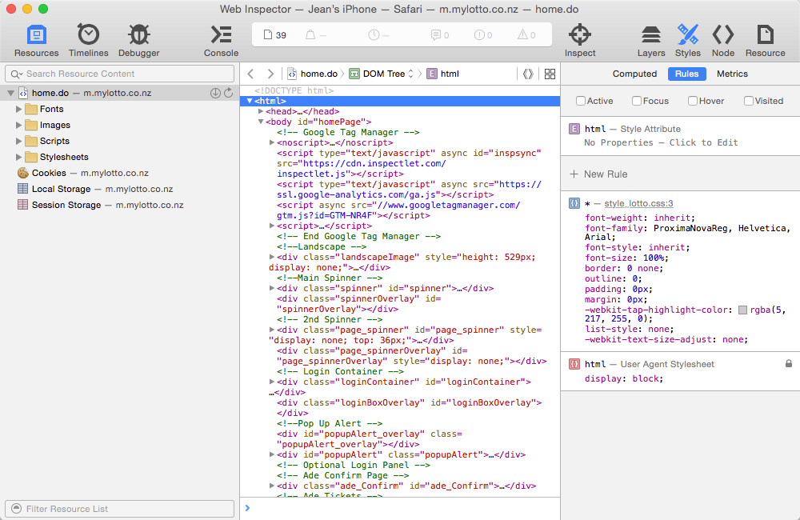
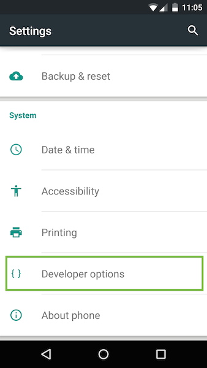
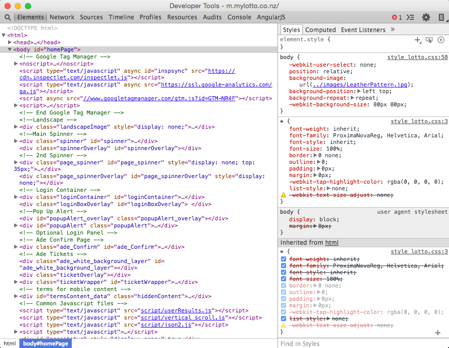

# Remote Mobile Debugging

It is not commonly known but you can remotely debug your mobile device using Safari and Chrome.

## iPhone Safari Debugging

This works on Safari > version 6. Unfortunately this is not available for all Operating Systems. This was tested on
MacOSX usign a recent Safari (8.0.6).

Requirements:
- iOS device with iOS > 6
- Device USB cable
- MacOSX computer

### Setting Up The Mobile Side
On your mobile device go to `Settings` > `Safari` > `Advanced` and toggle `Web Inspector` (to on)

As seen on an iPad (iOS6):


Plug in you device into the Computer using the USB cable.

### Setting Up The Computer Side
The first thing to do is start Safari and go to Preferenes.  Under Preferences go to the Advanced tab and tick the
`Show Developer menu in menu bar option` at the bottom of the page.


Launch Safari on the Mobile device if it has not been launched already...

Go to `Safari` > `<Device name>` > `<Page name>`


This will pop up the remote developer tools for the mobile device.



*Let the fun start!*

### Debugging On Other Operating Systems
It is possible to do the same on other operating systems using extensions and Chrome. This has not been tested. See
the web for more details.

## Android Chrome Debugging

This works on recent version (4.4+) of Android and any operating system that can run Google Chrome.
Requirements:
- Android device with Android >= 4.4
- Device USB cable
- Desktop / laptop computer with Chrome >= 32

***Please note that some companies make major changes to Android so the details might differ for your specific
device***

### Setting Up The Mobile Side
On the device enable USB debugging by going to `Settings` > `Developer options` and check the `USB debugging` checkbox.



Plug in you device into the Computer using the USB cable.

### Setting Up The Computer Side
The first thing to do is to start Chrome with the `--remote-debugging-port` option. This will vary from Operating
System to Operating System but here is the command for MacOSX:

```
open -a Google\ Chrome --args --remote-debugging-port=9222
```

Don't worry if it does not open a new Window or Tab.

Launch Chrome on the mobile device if it is not running already.

The final magic sauce is to go to Chrome and open `chrome://inspect`. When you check the `Discover USB devices` checkbox
You will be presented with a list of devices to inspect etc.


If you click on the inspect link it will pop up the remote developer tools for the mobile device.



*Let the fun start!*

### Doing Screencast

The chrome developer tools also have the option to display the remote Chrome tab using screencast technology.  This
mostly works but still has some issues.

## Sources
**iOS:** http://moduscreate.com/enable-remote-web-inspector-in-ios-6/

**Android:** https://developer.chrome.com/devtools/docs/remote-debugging

## Additional Useful Sources
**iOS, Android, Windows phone etc.:** http://developer.telerik.com/featured/a-concise-guide-to-remote-debugging-on-ios-android-and-windows-phone/#weinre
